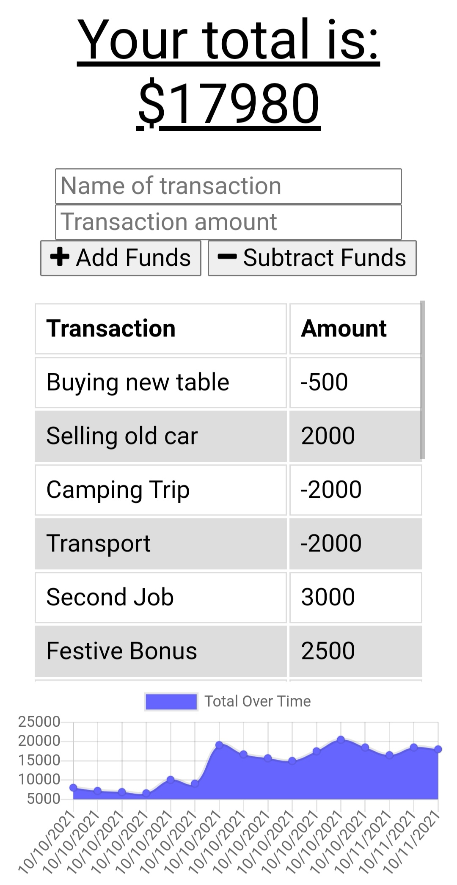

# Budget_Tracker  

## A budget tracker app that can keep track of your finances even if you are offline.


<a href="https://img.shields.io/badge/JavaScipt-100%25-yellow"></a> <a href="https://img.shields.io/badge/Used-Node.js-red"></a> <a href="https://img.shields.io/badge/Used-Express-orange"></a> <a href="https://img.shields.io/badge/Used-Dotenv-blueviolet"></a> <a href="https://img.shields.io/badge/Used-MongoDB-informational"></a> <a href="https://img.shields.io/badge/Used-Mongoose-success"></a> <a href="https://img.shields.io/badge/Used-PWA-9cf"></a> 


## Table of Contents

- [Description](#description)
- [Installation](#installation)
- [Usage](#usage)
- [Contribution](#contribution)
- [License](#license)
- [Contact Information](#contact-information)

## Description

  Managing finances can be a big challenge. If a person does not have the right tool to monitor his finances properly he may end up planning where he might be short of funds. Thus we introduce you to this modern day abacus the Budgeting App. It is a modern solution to keep track of your flow of finances. It's designed as a PWA (Progressive Web App) and works offline and can be installed on your mobile devices or local machines.

## Installation  

#### The application is deployed on heroku and can be used via clicking the link below.  

[BUDGET TRACKER](https://boiling-depths-21025.herokuapp.com/)

### To run and test the source code you need to follow the steps below

 * MongoDB is needed to create database. Follow the link below to install MongoDb in your computer.  

    To download MongoDB click [HERE!!!](https://www.mongodb.com/cloud/atlas/lp/try2-de?utm_content=rlsapostreg&utm_source=google&utm_campaign=gs_apac_rlsamulti_search_brand_dsa_atlas_desktop_rlsa_postreg&utm_term=&utm_medium=cpc_paid_search&utm_ad=b&utm_ad_campaign_id=14412646494&gclid=CjwKCAjwqeWKBhBFEiwABo_XBh5uZPBnBDKggMUYPRr8qnA0zkpf6QoTsvu-ha-dGjg8HeF8sSJVBRoCnvgQAvD_BwE)  

 
#### To run this code repo in your computer, user must install Node.js. 
#### User also need the following dependencies

    * Express
    * Mongoose 
    * Dotenv     
    * Compression

- open terminal
- clone the repo: `https://github.com/thossain89/Budget_Tracker.git`
- cd into new directory (Must be in directory to work) 
- Download all dependency package by entering `npm install`
- Run `Mongod` to initialize the database
- Create The database in MongoDB shell by running `npm run seed`
- Use `Robo3T` to view database
- Run `Nodemon server.js` to run for development purpose 


## Usage

```
Simply run 'nodemon server.js' and in a browser run the url: 
http://localhost:3001/

```


## Demo of Workout Tracker Installed on Android device:

     


## Contribution

If you would like to contribute to this project reach out to me. Contact Information can be found below or by clicking on the 'Contact-Information' link provided in the Table of Contents.

## License

<a href="https://img.shields.io/badge/License-MIT-brightgreen"></a>

## Contact Information

[Email Address](tanvirhossain2006@gmail.com)

[Github Repo ReadMe Generator](https://github.com/thossain89/Team_Profile_Generator.git)

## Authors   

  


* **Tanvir hossain** [Git Hub Profile](https://github.com/thossain89)  

&copy; 2021 Tanvir Hossain, Coding Bootcamp ,University of Sydney and Trilogy Education

